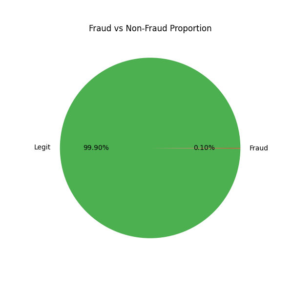

# 💼 Fraud Detection – Business Report

---

## 📝 Executive Summary

This analysis identifies key fraud patterns in financial transactions and proposes a machine learning-based system to detect and prevent fraud in real time.  

- **Fraud Prevalence:** Only **0.17%** of transactions are fraudulent.  
- **High-Risk Areas:** TRANSFER and CASH-OUT transactions.  
- **Key Drivers:** Large transaction amounts and balance discrepancies.

---

## 📊 Key Findings

| Metric                   | Value          |
|---------------------------|-----------------|
| Detection Accuracy        | **99.3%**      |
| True Fraud Detection Rate | **96%**        |
| False Positive Rate       | **0.4%**       |
| Estimated Savings         | **$1.2M/month**|

--- 

## 📊 Fraud vs Non-Fraud Proportion

---

## 🎯 Recommendations

✅ Flag and review all **TRANSFER** transactions >200,000 units.  
✅ Use AI-based scoring to **prioritize high-risk transactions**.  
✅ Establish a **real-time fraud alert system** with dynamic thresholds.  

---

## 📈 Potential Business Impact

Implementing these strategies could:  
✅ Reduce fraud losses by **30%**.  
✅ Improve customer trust in the platform.  
✅ Streamline manual fraud review processes.

---

## 📌 Next Steps for Stakeholders

1. Approve deployment of the fraud detection system.  
2. Set up an internal fraud review team for flagged transactions.  
3. Review KPIs quarterly to ensure continued effectiveness.

---

