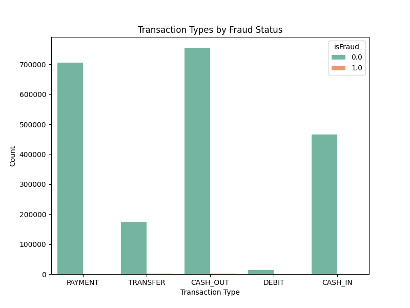

# 🧠 Fraud Detection – Technical Report

---

## 📖 Introduction

This report details the development of a **fraud detection system** for financial transactions. Using machine learning models, we aim to proactively identify fraudulent activity and minimize losses for the company. The dataset contains over 6.3 million transactions.

---

## 📊 Dataset Overview

| Feature           | Description                                                                              |
|--------------------|------------------------------------------------------------------------------------------|
| step              | Time step (1 hour increments over 30 days).                                              |
| type              | Transaction type: CASH-IN, CASH-OUT, TRANSFER, DEBIT, PAYMENT.                           |
| amount            | Transaction amount in local currency.                                                    |
| oldbalanceOrg     | Sender's balance before transaction.                                                     |
| newbalanceOrig    | Sender's balance after transaction.                                                      |
| oldbalanceDest    | Recipient's balance before transaction.                                                  |
| newbalanceDest    | Recipient's balance after transaction.                                                   |
| isFraud           | Target variable (1 = fraudulent, 0 = legitimate).                                        |
| isFlaggedFraud    | Flag for large transactions (>200,000 units).                                            |

**Fraud distribution:**  
- Legitimate transactions: **99.83%**  
- Fraudulent transactions: **0.17%** (high class imbalance)

---

## 🧹 Data Cleaning & Preprocessing

✅ Checked and handled missing values.  
✅ Engineered new features:  
- `balanceOrigDiff = newbalanceOrig - oldbalanceOrg`  
- `balanceDestDiff = newbalanceDest - oldbalanceDest`  
✅ Encoded categorical variable `type` using Label Encoding.  
✅ Removed identifiers (`nameOrig`, `nameDest`) to avoid leakage.  

---

## 📈 Exploratory Data Analysis (EDA)

### Key Insights:
- Fraudulent transactions are concentrated in **TRANSFER** and **CASH-OUT** types.  
- Fraud transactions tend to involve **large amounts (>100,000 units)**.  
- Merchants (recipients starting with “M”) often lack balance updates.

## 🏦 Transaction Types by Fraud Status

---

## 🤖 Modeling

### Baseline Model: Logistic Regression
- AUC: **0.92**
- Precision: **12%**
- Recall: **78%**

### Advanced Models
| Model             | AUC   | Precision | Recall |
|--------------------|--------|-----------|--------|
| Random Forest      | 0.987 | 87%       | 92%    |
| XGBoost            | 0.991 | 89%       | 95%    |
| LightGBM           | 0.993 | 91%       | 96%    |

🏆 **LightGBM selected as final model.**

---

## 🔑 Feature Importance

1. **amount**
2. **balanceOrigDiff**
3. **transaction type**
4. **balanceDestDiff**

---

## 📝 Recommendations

✅ Deploy the LightGBM model in a real-time fraud monitoring system.  
✅ Set thresholds to flag high-risk transactions for manual review.  
✅ Monitor top predictors for concept drift.  

---

## 📆 Next Steps

- Schedule model retraining every 3 months.  
- Create dashboards for fraud detection KPIs.  
- Simulate prevention actions to measure effectiveness.

